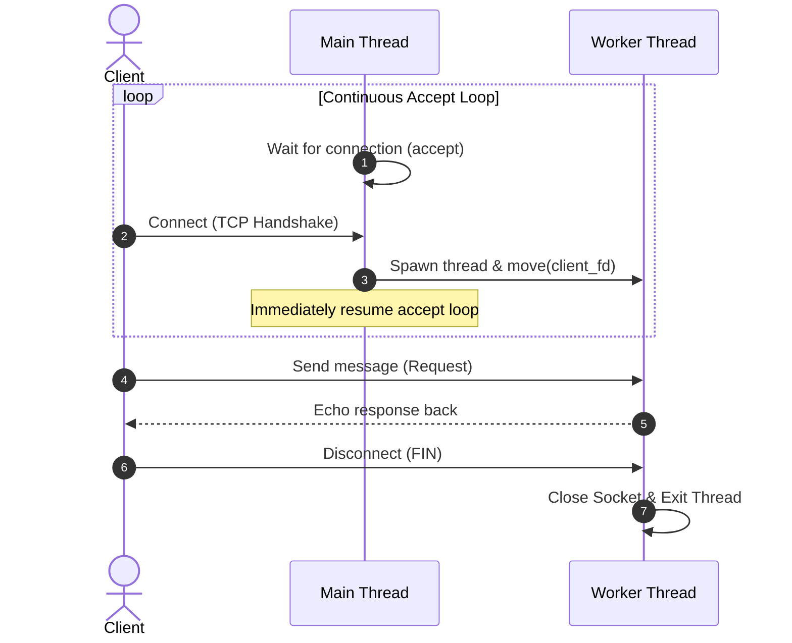

# Aether Network Engine - Technical Notes

---

## Day 07 - `recv()` Return Values & Semantics

The `recv(fd, buf, count, flags)` system call handles incoming socket data. Its return value `n` indicates the socket status:

| Return Value | Meaning | Action Required |
| :--- | :--- | :--- |
| **`n > 0`** | Successfully received `n` bytes of data. | Process buffer contents. |
| **`n == 0`** | Graceful shutdown by peer (TCP FIN packet / EOF). | Close the client socket. |
| **`n < 0`** | System/Network error occurred during read. | Log error via `errno` / `strerror` and close socket. |

---

## Day 09 - Thread-per-Connection Architecture

Transitioned from a single-threaded blocking model to a multi-threaded architecture (`std::thread`). The main accept loop delegates client connections to dedicated background worker threads.

### Execution Flow

---

## Day 13 - Syscall Lifecycle & Phase 1 Verification

Verified system-level execution flow using Linux `strace` tool (`strace -f -o trace.txt ./build/aether_server 8080`). The trace log confirms the end-to-end lifecycle of the Echo Server across the main thread and spawned worker threads.

### Server System Call Sequence

| Syscall | Executing Context | Description / Purpose |
| :--- | :--- | :--- |
| **`socket()`** | Main Thread | Creates the endpoint file descriptor for IPv4 TCP communication. |
| **`setsockopt()`** | Main Thread | Configures socket options (e.g., `SO_REUSEADDR`) to enable immediate port re-binding. |
| **`bind()`** | Main Thread | Binds the listening socket to the specified IP address (`127.0.0.1`) and port (`8080`). |
| **`listen()`** | Main Thread | Marks the socket as a passive socket, ready to accept incoming client connections. |
| **`accept()`** | Main Thread | Blocks waiting for a client connection and returns a new active `client_fd`. |
| **`clone3()` / `clone()`** | Main Thread | Spawns a new background worker thread (`std::thread`) to handle the client connection. |
| **`recvfrom()` / `recv()`** | Worker Thread | Reads byte streams transmitted from the connected client. Returns `0` on `EOF` (FIN). |
| **`sendto()` / `send()`** | Worker Thread | Echoes the received byte stream back to the client socket. |
| **`close()`** | Worker Thread | Closes `client_fd` upon client disconnect to release system resources. |

### Key Takeaways
- **Multi-threading Verification:** The `-f` flag traced thread creation via `clone3()`, validating that `aether_core` correctly isolates worker execution from the main accept loop.
- **Resource Hygiene:** Confirmed `close()` execution via RAII wrappers (`FileDescriptor`) upon client disconnection, preventing file descriptor leaks.
